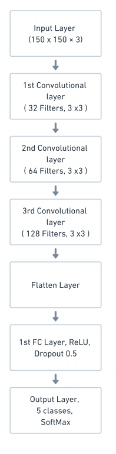
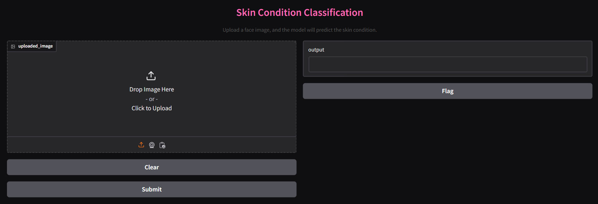

### A CNN-Based Approach for Image Recognition and Categorizing Facial Skin Conditions

This repository contains a Convolutional Neural Network (CNN) model for classifying facial images into five skin condition categories:  

- **Acne**  
- **Hyperpigmentation/Discoloration**  
- **Oily Skin**  
- **Dry Skin**  
- **Normal Skin**  

The model utilizes a **Gradio interface** to provide a user-friendly platform for predictions, enabling users to upload a facial image and receive the skin condition classification.

---

## Features  

- **CNN Architecture:** Designed and trained for accurate classification.  
- **Gradio Interface:** Intuitive web-based UI for uploading images and receiving predictions.  
- **Custom Dataset:** Images collected and labeled for each skin condition.  
- **Python Implementation:** Easy-to-follow, modularized codebase for training, testing, and deploying the model.  

---

## Installation  

1. **Clone the Repository**  
   ```bash  
   git clone https://github.com/ruru-lyy/skin-classification-cnn.git  
   cd skin-classification-cnn  
   ```  

2. **Install Dependencies**  
   Ensure you have Python 3.8 or higher installed. Install the required packages using:  
   ```bash  
   pip install -r requirements.txt  
   ```  

3. **Download Dataset**  
   Collect and organize facial images into the `data/` directory with the following structure:  
   ```  
   data/  
   ├── sample_acne/  
   ├── sample_hyperpigmentation/  
   ├── sample_oily/  
   ├── sample_dry/  
   └── sample_normal/  
   ```  

4. **Train the Model (Optional)**  
   To train the CNN on your dataset, run:  
   ```bash  
   python train.py  
   ```  
   The trained model will be saved in the `models/` directory.  

---

## Model Architecture  

The CNN model uses the following components:  
- Convolutional layers with ReLU activations.  
- Max-pooling layers for dimensionality reduction.  
- Dropout for regularization.  
- Fully connected layers for classification.
  
  

For more details, refer to `model.py`.  

---

## Usage  

### 1. **Run the Gradio Interface**  
Start the Gradio app for predictions:  
```bash  
python app.py  
```  
The interface will open in your default web browser or display a local URL in the terminal.  

### 2. **Upload Image**  
Use the Gradio UI to upload an image of a face. The model will predict the skin condition and display the result.  


---

## Example  

  

---
## Future Enhancements  

- Increase the dataset size for improved accuracy.  
- Integrate additional features such as skin-care recommendations based on predictions.  
- Deploy the model on the cloud for global access.  

---

## Contributing  

Contributions are welcome! Please create a pull request or open an issue if you encounter any bugs or have feature suggestions.  

---

## License  

This project is licensed under the MIT License. See the `LICENSE` file for more details.  

---  

Feel free to use and adapt this project. If you find it helpful, please give this repository a ⭐ on GitHub! 😊
